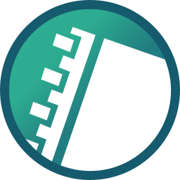
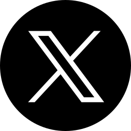

# SVG Icons
## Icons List
### Squere
|ID / Name|Icon|
:-:|:-:
|`Android-Light`||
|`Android-Dark`||
|`Cmd-Light`||
|`Cmd-Dark`||
|`MIT_AppInventor`||
|`VBA-Light`||
|`VBA-Dark`||

### Circle
|ID / Name|Icon|
:-:|:-:
|`GitHub-Light`||
|`GitHub-Dark`||
|`pixiv`||
|`Skeb`||
|`X-Light`||
|`X-Dark`||
